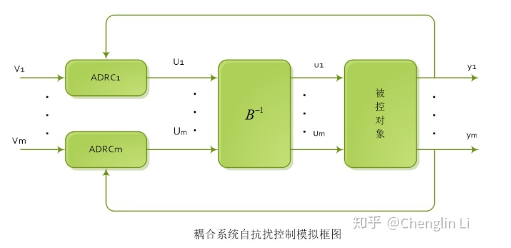

# 耦合系统控制

> [自抗扰控制理论（二）ADRC控制多变量耦合系统 - 知乎](https://zhuanlan.zhihu.com/p/115331084)

我是这样理解的: 对于一个多输入对多输出互相耦合的系统, 还是要知道**输入这部分**的模型信息才能解耦.

以一个二阶系统(2个状态变量)为例:

$$
\begin{cases}
\ddot{x}_1&=f_1(x_1,x_2,\dot{x}_1,\dot{x}_2)+ b_{11} u_1+b_{12} u_2\\
\ddot{x}_2&=f_2(x_1,x_2,\dot{x}_1,\dot{x}_2)+ b_{21} u_1+b_{22} u_2\\
\end{cases}
$$

其中 $f_1,f_2$ 是未知部分, 当作扰动使用 ESO 观测并抵消掉, 不予考虑;
$b_{ij}$ 表示输入带来的共同作用, 按理说这种耦合**也可以当作扰动**, 使两个 ADRC 回路分别控制(《自抗扰控制入门》朱斌里提到ADRC有天然的解耦性), 但显然这只是理想情况, 实际会给扰动的观测和控制带来很大挑战.. 左右互搏.. (对于弱耦合, 我觉得 ADRC 可以应对)

所以, 我们实际要控制的输入 $u_1,u_2$ 作用效果互相耦合, 就假设出虚拟的控制量 $\tau_1=b_{11} u_1+b_{12} u_2, \tau_2=b_{21} u_1+b_{22} u_2$

矩阵形式表示这种转换:

$$
\begin{bmatrix}\tau_1\\ \tau_2\end{bmatrix}=
\begin{bmatrix}b_{11} & b_{12}\\ b_{21} & b_{22}\end{bmatrix}\begin{bmatrix}u_1\\ u_2\end{bmatrix}=
B\begin{bmatrix}u_1\\ u_2\end{bmatrix}
$$

即有 ADRC 的标准形式:

$$
\begin{cases}
\ddot{x}_1&=f_1(x_1,x_2,\dot{x}_1,\dot{x}_2)+ \tau_1\\
\ddot{x}_2&=f_2(x_1,x_2,\dot{x}_1,\dot{x}_2)+ \tau_2\\
\end{cases}
$$

其实实思路就很简单, 我们使用控制器对 $\tau-y$ 进行控制, 计算出控制量后, 还原为原控制信号即可…

注释:

- $u$ 是物理意义更直接的控制量, 而 $\tau$ 是控制上更直观的控制量. 通过计算, 把$\tau$ 还原为实际控制信号$u$后, 如果计算的结果超出了物理限定, 就简单地回归符合物理限定的值就好.
    - 另外, 这种物理限定在 ADRC 控制器的角度是一种意料之外的扰动, 所以也许应该让它知道. 就是说 ESO 在估测状态的时候, 系统的输入 $u$ 设成 物理限定后还原为的 $u'$
- $B$ 有可能存在非奇异的问题, 对于可逆变换, 才能用这种方法实现解耦.
