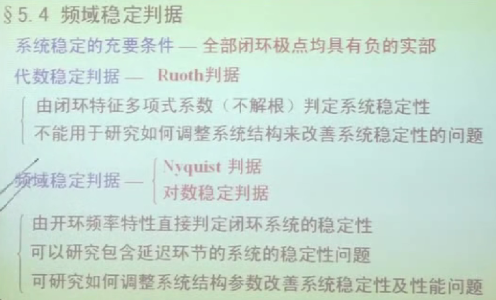

# 第一章 自动控制的一般概念

[toc]

## 1 最小相位系统

> [当我们谈 “最小相位系统” 时究竟在谈什么？](https://zhuanlan.zhihu.com/p/108053853)

之前的笔记做了一部分，现在结合卢京潮老师提到的记录一下

非最小相位系统（nonminimum phase systems），若控制系统有位于 s 右半开平面上的极点或零点，则称它为非最小相位系统。

增加延时环节也会产生非最小相位系统

$$
e^{-\tau s}\approx \frac{\frac 2\tau-s}{\frac 2\tau+s}
$$

右半平面零极点对应不稳定环节 , 如 $\tau s-1$。

非最小相角系统 ⇒ 一定是条件稳定 （根据根轨迹，从开环极点到开环零点，一定存在 K, 使根到达右半平面）. 换个角度，并非最小相位系统就一定不稳定，只是更难控制了而已，从根轨迹去理解.

最小相角系统由 $L(\omega)$ 可以唯一确定 $\varphi(\omega)$

对于最小相角系统，相角裕量$\gamma>0$时，系统一定稳定（$h>1$）。[课本上的表述：至多仅存在一个 $\omega_x,\omega_c$ , 且开环传递函数无 s 右半平面极点时，$\gamma>0,h>1$ ⇒ 稳定]

1. 非最小相位系统在初始阶段有与我们想要的稳态跟踪值反向的输出，我们姑且称之为 **「一个 “欲扬先抑” 的行为」** 。
    

2. **在具有相同幅值特性的系统中，最小相位系统的相角变化范围是最小的.** 非最小相位系统**相位变化最少**

    在正弦信号的作用下，具有相同幅频特性的系统（或环节），最小相位系统的相位移最小，而非最小相位系统的相位移大于最小相位系统的相位移。

    画相频特性曲线时，**根据经验来说**, 添加一个不稳定环节，更可能使相频特性曲线刚开始有一个反向变化的过程.

    从$G$分析，不稳定环节和稳定环节在最终的相位相同，只是开始不一样. $\tau s+1: 0\to\frac\pi2$, 而 $\tau s-1: \pi\to\frac\pi2$

> [最小相位系统与非最小相位系统的区别](https://blog.csdn.net/qq_39554681/article/details/89256995)
>
> 非最小相位情况产生的原因，一是系统包含有非最小相位元件 （带有时滞特性 / 延时，相位滞后），二是系统的内部回路不稳定 （有正根）；
>
> 非最小相位环节对系统造成的影响
> 非最小相位系统响应缓慢 （原因在于，具有相同幅频特性的情况下，非最小相位系统具有更大的相角变化范围，这带来了频域上的相位滞后，表现在时域上即为阶跃响应稳态值相同的情况下，上升时间和调节时间更长）；
>
> 最小相位系统因为相移小，在实际工程应用中表现为同频率输出信号在时间上能够很快的跟踪上输入，说白了就是时延小。这样的系统就比较容易设计控制器，调节效果一般也都不错。
>
> 再来说非最小相位系统，非最小相位系统因为相位差别大，往往会造成输出的信号的时延增大，时域响应由于存在不稳定的零点，甚至会出现反向效应，这样的系统想设计可实现的控制器，就比较困难了。
>

## 2 名词汇总

频率名词：

- 谐振频率 $\omega_r$；
- 带宽频率$\omega_b$ ；
- 截止频率$\omega_c$；
- 阻尼振荡角频率$\omega_d$ ;
- 穿越频率 $\omega_x$

---
静态系统：输出只取决于当前系统的顺势输入
动态系统：能存储输入信息（能量）的系统，输出取决于当前及过去输入信息影响的叠加.

线性系统非线性系统
时变系统非时变系统
连续时间系统离散时间系统

---
数学表达符号备注：
输入信号：$U(s),R(s)$
输出信号：$Y(s),C(s)$
> 输入 `ru` ：`r(t)`
> 输出 `chu` ：`c(t)`

时域函数使用小写$c(t)$
变换过后的传递函数使用大写$C(s)$

如果时域函数是$\theta(t)$, 使用$\bar\theta(s)$代表传递函数（老师说是因为$\theta$没有大写，但是 Latex 里面大写应该是$\Theta$）

导数：
$\dot{c}(t)$一阶导数，$\ddot{c}(t)$二阶导数

## 3 绪论 （上课笔记）

**自动控制原理**：讲的是经典控制理论（其中离散部分分到了**计算机控制技术**讲授）
**现代控制理论**讲的是众多现代控制理论中的状态反馈控制。

### 3.1 基本概念

自动控制是指在没有人直接参与的情况下，利用自动控制装置（简称**控制器**） 使机器、设备或生产过程（称为**被控对象**）的某个工作状态或参数（称为**被控量**）自动地按照预定的规律进行。

控制器和控制对象的总和称为控制系统。
参与控制的信号来自三条通道，即给定值、干扰量、被控量。

**除被控对象外的其余部分**统称为控制装置，它**必须具备**以下三种职能部件：

- 测量元件
- 比较元件
- 执行元件

> 测量元件、给定元件（给出系统输入量）、比较元件、放大远见、执行元件、校正元件/补偿元件

控制相关的概念：

- 基本控制方式
    - 开环控制：结构简单、成本低（自动售货机、自动洗衣机等）
    - 闭环控制
- 偏差扰动
    - 按偏差控制：抑制内外干扰
    - 按扰动控制：利用扰动信号（通常已知）产生补偿作用，低效扰动的影响。（按扰动控制的开环控制系统）
- 复合控制：开环+闭环，偏差+扰动

### 3.2 控制系统的分类（**填空题**）

- 按信号的传递途径
    - 开环系统
    - 闭环系统
- 按参考输入的特征（反馈量特点）
    - 恒值调节系统：保证输出稳定不变
    - 随动系统
        - 保证输出稳定增长，例如参考输入为测量位移，保证速度稳定不变
        - 跟踪目标等：输出量能够以一定准确度跟随输入量的变化而变化的系统称为随动系统，亦称伺服系统。快速跟踪和准确定位是随动系统的两个重要技术指标。
    - （程控系统）：这个是看的网课提到的，指输出程序控制的输出。
- 按信号的特征（输入输出信号）
    - **连续系统**
    - 离散系统（计算机控制技术讲）
        - 采样控制系统：抽样信号（幅值连续）
        - 数字控制系统：数字信号（幅值离散）
- 按输入输出个数
    - **单输入单输出 SISO**
    - 多输入多输出 MIMO
- 按元件特性
    - **线性系统**：线性系统的充要条件就是**满足叠加定理**（齐次定理）
    - 非线性系统
- 控制系统的结构、参数
    - **定常系统/时不变系统**：可以使用常系数微分方程描述。
    - 时变系统
- 按描述方程
    - **集中参数系统**
    - 分布参数系统

> **EXAM** 英语单词
> 稳定性：stability
> （时域：time domain 频域：frequency domain)
> 时域特性：time domain characteristic
> 暂态特性 transient behavior/characteristic （类似的说法都可以）
> 时域法：time domain analysis method
> 根轨迹法：root locus method
> 频域法：frequency domain analysis method
> 开环 open-loop 闭环 closed-loop
> 线性 linear 非线性 nonlinear
> 连续 continuous 离散 discrete
> 系统 system

### 3.3 控制系统性能

基本要求：

- 稳：要求系统稳定
- 准：稳态性能（稳态误差等）, 要求准确，输出跟随精度高.
- 快：暂态性能（上升时间，调节时间，超调量等）：要求快速平稳收敛.

分析方法：

- 时域法
- 根轨迹法
- 频域法

可以利用各种分析方法对系统性能进行分析，同时稳定性与快速收敛不可兼得，需要权衡。

### 3.4 历史发展

- 经典控制理论 SISO
- 现代控制理论
- 智能控制：借助计算机，模拟人的经验，感知

**经典控制理论** (19 世纪初—20 世纪 50 年代）
时域法
复域法（根轨迹法）
频域法

**现代控制理论** ( 20 世纪 60 年代— )
线性系统  自适应控制  预测控制
最优控制  鲁棒控制    滑模控制
最佳估计  容错控制    大系统复杂系统
系统辨识  集散控制    非线性系统理论

**智能控制理论** ( 20 世纪 70 年代— )
专家系统  遗传算法
模糊控制  多智能体
神经网络
